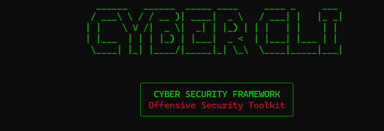

# 🛡️ Cyber Framework



A **modular cybersecurity CLI framework** written in Python designed for reconnaissance, scanning, vulnerability analysis, and automated attack chains.

The framework provides:

- 🟢 Beginner Mode (menu-based)
- 💻 Advanced Console Mode
- ⚔️ Automated Attack Chain Engine
- 🧠 Intelligence & attack graph generation
- ⌨️ Professional interactive console

Inspired by penetration testing frameworks such as **Metasploit**.


```

cyber> show modules
cyber> use recon
cyber(recon)> set target google.com
cyber(recon)> run

```

---

# 🚀 Features

### Core Framework
✅ Beginner Mode  
✅ Advanced Console Mode  
✅ Automatic Module Discovery  
✅ Automated Attack Chain Engine  
✅ Real-time Scan Progress  

### Console Experience
⌨️ TAB command auto-completion  
🧠 Syntax highlighted commands  
📜 Persistent command history  
🎯 Dynamic module prompt  

### Security Engine
🔍 Reconnaissance modules  
🌐 Network scanning modules  
🕸 Web vulnerability scanning  
⚡ Exploit phase integration  

### Advanced Capabilities
📊 Attack Graph Generation  
🧠 Intelligence Engine  
🗄 SQLite Scan Database  
⏱ Scan Scheduler  
🌍 Distributed scanning support  

---

# 🏗 Architecture

Cyber Framework follows a **modular architecture**.


```
         +-------------------+
         |      main.py      |
         +---------+---------+
                   |
                   v
           +--------------+
           |   Console    |
           +--------------+
                   |
                   v
            +-----------+
            | Command   |
            |  Parser   |
            +-----------+
                   |
      +------------+-------------+
      |                          |
      v                          v


+---------------+          +---------------+
|  Core Engine  |          |    Modules    |
+---------------+          +---------------+
|               |          |               |
| Attack Chain  |          | Recon         |
| Intelligence  |          | Scan          |
| Scheduler     |          | Web Scan      |
| Database      |          | Exploit       |
| Attack Graph  |          | Discovery     |         
| Intelligence  |          | Enumeration   |
+---------------+          +---------------+ 

```

Detailed architecture available in:

📄 `docs/architecture.md`

---

# 📁 Project Structure

```

cyber-framework/
│
├── main.py
├── requirements.txt
├── config.json
│
├── core/
│   ├── console.py
│   ├── command_parser.py
│   ├── module_loader.py
│   ├── attack_chain.py
│   ├── progress_engine.py
│   ├── session_manager.py
│   ├── intelligence_engine.py
│   ├── attack_graph.py
│   ├── database.py
│   ├── scheduler.py
│   └── distributed_controller.py
│
├── modules/
│   ├── recon.py
│   ├── scan.py
│   ├── web_scan.py
│   ├── exploit.py
│   ├── discovery.py
│   ├── enumeration.py
│   └── intelligence.py
│
├── ui/
│   └── banner.py
│
├── data/
│   ├── scan.db
│   └── command_history.txt
│
└── docs/
├── architecture.md
└── usage.md

```

---

# ⚙️ Installation

Clone repository:

```

git clone https://github.com/Bhuvaneshkumar1/cyber-framework.git
cd cyber-framework

```

create virtual environment

```
python -m venv venv

```

Install dependencies:

```

pip install -r requirements.txt

```

---

# ▶️ Running the Framework

```

python main.py

```

Select mode:

```

Beginner Mode
Advanced Console

```

---

# 🟢 Beginner Mode

Menu-driven operation.

Example:

```

Select Mode → Beginner Mode
Target → example.com
Select Operation → Recon / Scan / Web Scan / Exploit / Attack Chain

```

---

# 💻 Advanced Console Mode

Professional CLI console.

Example:

```

cyber> show modules

```
```

Available Modules
recon
scan
web_scan
exploit
discovery
enumeration
intelligence

```

Select module:

```

cyber> use recon

```

Set target:

```

cyber(recon)> set target example.com

```

Run module:

```

cyber(recon)> run

```

---

# ⚔️ Automatic Attack Chain

Runs a full automated pipeline:

```

Recon
↓
Scan
↓
Web Scan
↓
Exploit

```

Command:

```

cyber> set target example.com
cyber> run attack_chain

```

---

# ⌨️ Console Features

| Feature | Description |
|------|-------------|
| TAB completion | Auto-complete commands |
| Syntax highlighting | Colored commands |
| History persistence | Arrow key navigation |
| Dynamic prompts | `cyber(recon)>` style |

Example:

```

cyber(recon)> set target google.com
cyber(recon)> run

```

---

# 🧩 Available Modules

| Module | Purpose |
|------|---------|
| recon | DNS & domain reconnaissance |
| scan | Network port scanning |
| web_scan | Web vulnerability scanning |
| exploit | Exploitation phase |
| intelligence | Target intelligence gathering |

---

# 💾 Data Storage

Framework stores persistent data:

```

data/scan.db
data/command_history.txt

```

---

# 📚 Documentation

Additional documentation:

📄 `docs/architecture.md`  
📄 `docs/usage.md`

---

# 🧑‍💻 Author

Developed as a **modular cybersecurity framework for learning and research purposes.**

---

# ⚠️ Disclaimer

This tool is intended **for educational and authorized security testing only**.

Do **NOT** use this tool against systems without permission.

---

# 📜 License

MIT License

# 👨‍💻 Contributors

- Bhuvaneshkumar
